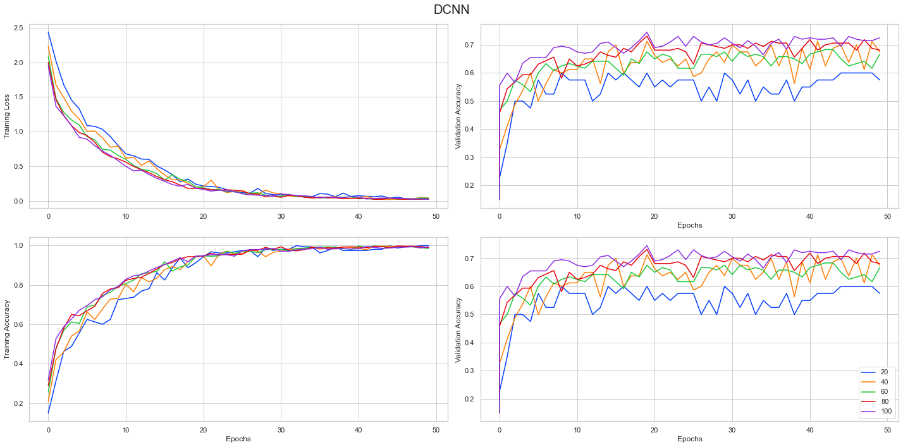
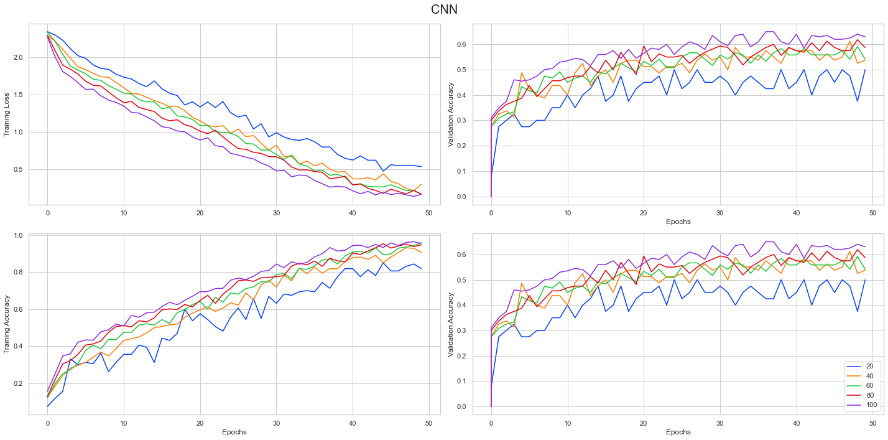
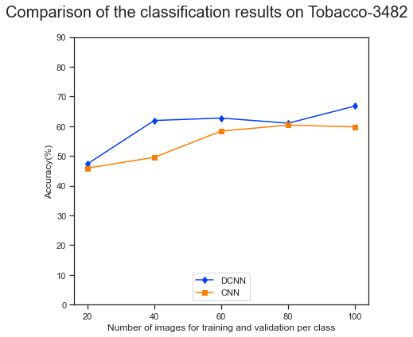
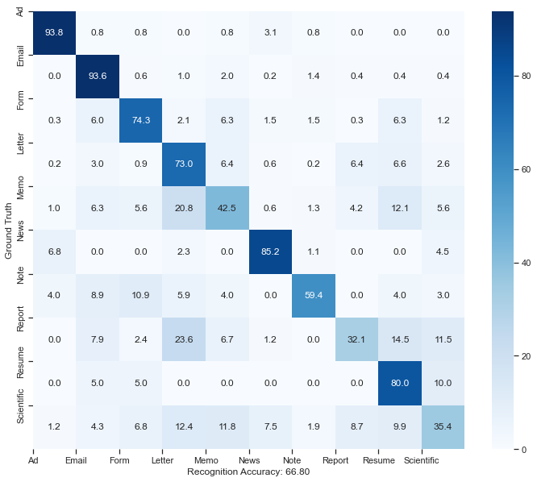

<div align="center">    
 
# DeepDocClassifier - Paper Implementation   

</div>

In this repository, I have implemented a document classifier based on [Deepdocclassifier: Document classification with deep Convolutional Neural Network](https://ieeexplore.ieee.org/document/7333933) (DCNN), which is trained and evaluated using the Tobacco-3482 dataset. I have partitioned the dataset into five partitions with different sizes for training and validation datasets for assessing the network. Five partitions used for evaluation include 20, 40, 60, 80, and 100 samples used for training and validations. The rest of the images are used for testing purposes. This evaluation method is taken from the original approach to compare results. To compare results, similar to the original paper, results are compared with [Convolutional Neural Networks for Document Image Classification](https://projet.liris.cnrs.fr/imagine/pub/proceedings/ICPR-2014/data/5209d168.pdf) (CNN).

In this repository, DCNN and CNN are implemented using PyTorch and PyTorchLightning. To create partitions of data with different training and validation sizes, `LightningDataModule` is used, consumed by the Trainer class of PyTorchLightning. 

Both DCNN and CNN are trained using locally using 
- Processor: Intel(R) Core(TM) i7-10510U CPU @ 1.80GHz 2.30 GHz and 
- GPU: NVIDIA GeForce MX230

Before training the neural network, the package from the repository is installed using the setup file. After installing the requirements using the `requirement.txt` file, the package can be installed locally after cloning the repository and running the below command from the home of the repository:
```{bash}
pip install .
```

After installing the repository into local, the DCNN method is trained using configuration from YAML file, provided in `config/deepDocConfig.yaml`. The neural network can be trained by executing the python module from the command line as below:

```{bash}
python -m deepDocClassifier.main -c <path of config file>
```

After training each model using different partitions of the training and validation dataset, the remaining samples are used as test data for evaluation. All models are tested using the remaining samples, and a CSV file is generated for further evaluation. The training process is logged using tensorboard and pushed to [tensorboard dev](https://tensorboard.dev/experiment/sL0GDdIbQxiGEuxRQ6kIGw/#scalars) for reference.

Using the tensorboard logs and test results, I have generated the learning curve, comparing results on test data for DCNN and CNN. Finally, a confusion matrix plot is plotted for the DCNN method for a partition using 100 samples.

Below plots shows the learning curve using five different partitions, using number of samples for training and validation data equal to 20, 40, 60, 80, and 100.
- DCNN:

> 
- CNN    
> 
    


## Test Accuracy


<div>
<style scoped>
    .dataframe tbody tr th:only-of-type {
        vertical-align: middle;
    }

    .dataframe tbody tr th {
        vertical-align: top;
    }

    .dataframe thead th {
        text-align: right;
    }
</style>
<table border="1" class="dataframe">
  <thead>
    <tr style="text-align: right;">
      <th>Partition size</th>
      <th>DCNN</th>
      <th>CNN</th>
    </tr>
  </thead>
  <tbody>
    <tr>
      <th>20</th>
      <td>47.288239</td>
      <td>45.917124</td>
    </tr>
    <tr>
      <th>40</th>
      <td>61.940299</td>
      <td>49.545750</td>
    </tr>
    <tr>
      <th>60</th>
      <td>62.768910</td>
      <td>58.362248</td>
    </tr>
    <tr>
      <th>80</th>
      <td>61.036540</td>
      <td>60.402685</td>
    </tr>
    <tr>
      <th>100</th>
      <td>66.800967</td>
      <td>59.790492</td>
    </tr>
  </tbody>
</table>
</div>


#### Comparison of the classification results on Tobaco-34


    
> 
    
#### The class confusion matrix of the results obtained by one partition which contains 100 images from each class and rest of the images are used for testing.
> 


A notebook extracting these tensorboard event files and csv files to generate above plots given [here](results/DCNNvsCNN.ipynb)
    

